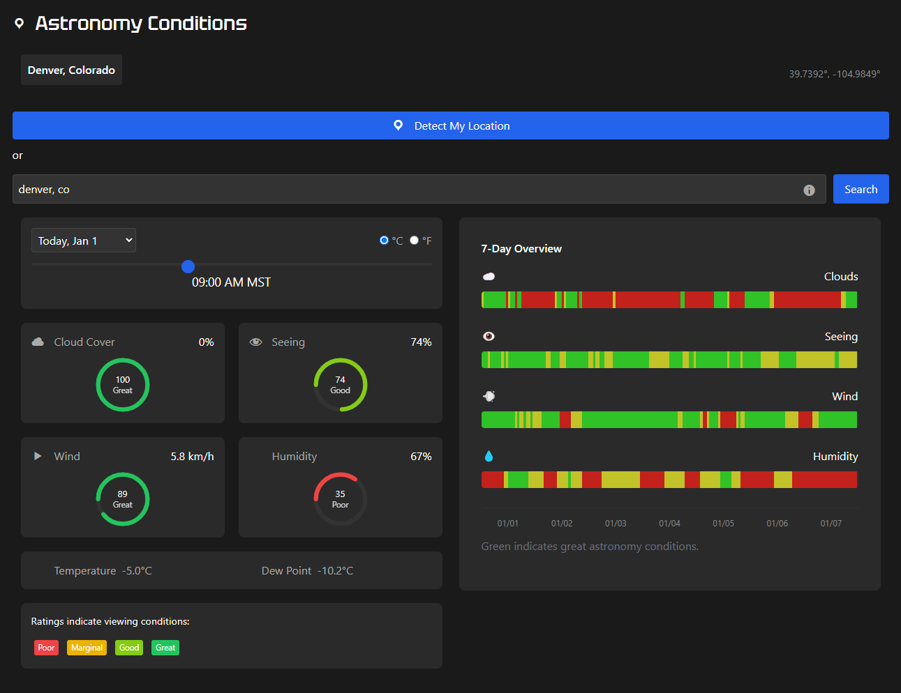

# JGAstroConditions - Astronomy Weather Dashboard

A WordPress plugin that provides a visual dashboard for astronomy and astrophotography weather conditions. Users can check cloud cover, seeing conditions, wind, humidity, temperature, and dew point for their location over a 7-day period.

## Screenshot

### Main Dashboard

*The dashboard displays current conditions with color-coded indicators for cloud cover, seeing, wind, and humidity.*

## Features

- Visual dashboard with color-coded condition indicators
- 7-day forecast with hourly data
- Location detection or manual location entry
- Key metrics for astronomy:
  - Cloud cover
  - Seeing conditions
  - Wind speed 10m above ground
  - Humidity
  - Temperature 2m above ground
  - Dew point
- Responsive design for mobile and desktop
- Timeline view for tracking conditions over multiple days

## Seeing Conditions Calculation

The plugin calculates astronomical seeing conditions using a weighted algorithm that considers multiple factors:

-  Temperature-Dew Point Spread (30% weight)
  - Larger differences between temperature and dew point generally indicate better seeing
  - Score improves as the spread increases, up to a maximum beneficial difference
  - Helps predict atmospheric stability and moisture content
- Wind Speed (30% weight)
  - Optimal conditions: 5-10 km/h
  - Below 5 km/h: Score reduces (insufficient air mixing)
  - Above 10 km/h: Score reduces more sharply (turbulence)
  - Above 20 km/h: Poor conditions for observation
- Humidity Impact (20% weight)
  - Lower humidity generally correlates with better seeing
  - Score decreases as humidity increases
  - High humidity can indicate potential for dew formation on equipment
- Temperature Stability (20% weight)
  - Measures the rate of temperature change
  - Smaller changes indicate more stable air
  - Each degree of change per hour reduces the score
  - Rapid temperature changes often indicate unstable air masses

The final seeing score (0-100) combines these factors, providing a comprehensive assessment of likely observing conditions. Values above 80 indicate potentially excellent seeing conditions when combined with clear skies and low humidity.

## Installation

1. Download the latest release from the GitHub repository
2. Upload the plugin folder to your WordPress site's `/wp-content/plugins/` directory
3. Activate the plugin through the 'Plugins' menu in WordPress
4. Use the shortcode `[astro_weather_dashboard]` in any post or page

## Usage

Add the dashboard to any post or page using the shortcode:
```shortcode
[astro_weather_dashboard]
```

You can also specify default coordinates:
```shortcode
[astro_weather_dashboard latitude="45.5155" longitude="-122.6789"]
```

## Requirements

WordPress 5.0 or higher
PHP 7.2 or higher
Modern web browser with JavaScript enabled

## Credits
This plugin uses the following services and libraries:

- Open-Meteo API for weather data
- OpenStreetMap Nominatim for geocoding
- React for the timeline view
- jQuery UI for controls
